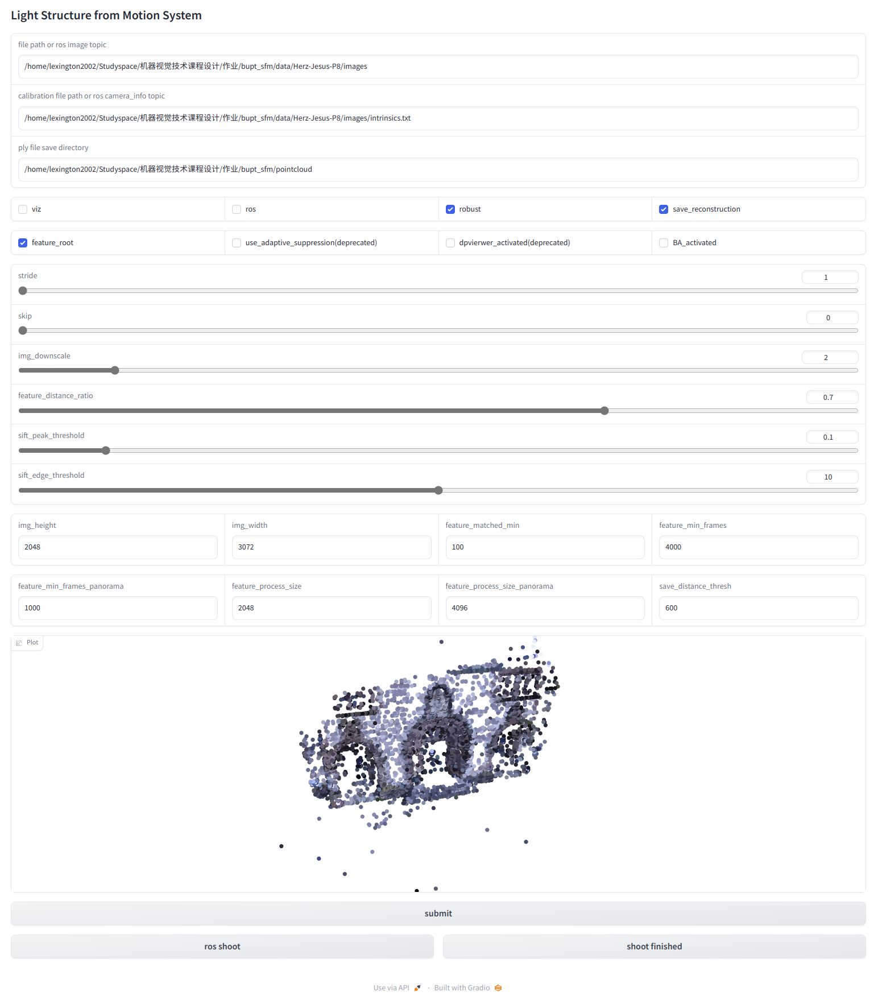
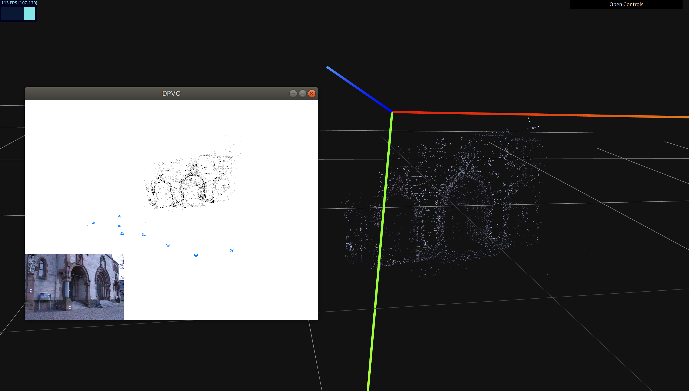
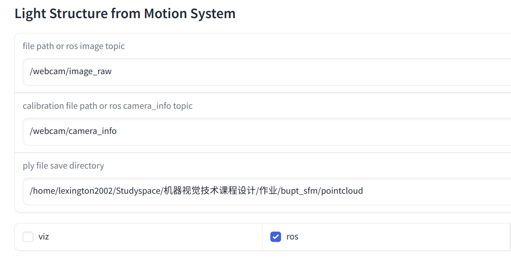

# bupt_sfm

## Setup and Installation

The code was tested on Ubuntu 18.04 LTS and Cuda 11.7.

Clone the repo

```bash
git clone https://github.com/Lady-Lex/bupt_sfm.git
cd bupt_sfm
```

Create and activate the sfm anaconda environment:

```
conda env create -f environment_base.yml
conda activate sfm
```

## Recommended - Install the Pangolin Viewer

Note: You will need to have CUDA 11 and CuDNN installed on your system.

1. Step 1: Create and activate the sfm_pg anaconda environment:

   ```bash
   conda env create -f environment_pg.yml
   conda activate sfm_pg
   ```

2. download and install eigen:

   ```bash
   wget https://gitlab.com/libeigen/eigen/-/archive/3.4.0/eigen-3.4.0.zip
   unzip eigen-3.4.0.zip -d thirdparty
   ```

3. Step 3:  Install Pangolin (need the custom version included with the repo)

   ```bash
   ./Pangolin/scripts/install_prerequisites.sh recommended
   mkdir Pangolin/build && cd Pangolin/build
   cmake ..
   make -j8
   sudo make install
   cd ../..
   ```

4. Step 4: Install the viewer

   ```bash
   pip install ./DPViewer
   ```

## Demo

​		bupt_sfm can be run on image directory or ros topics with a single command and config yaml file,  "default.yaml" is ok for prepared dataset in "data" folder. If run code without webui but need to visualize the reconstructions,  you will need to have installed DPViewer.

```bash
python demo.py
```

## launch webui

​		bupt_sfm can be launched by gradio webui.

```bash
python webui_launcher.py
```

​		Set configures under the Instruction of following section, then click "submit" button.

## config Instructions

​		This Instruction is suitable for both demo and webui.

```yaml
##################################
# Params for running
##################################
# image directory or ros image topic
running_image_dir: ./data/Herz-Jesus-P8/images
# camera intrinsics file or ros camera info topic
running_calib: ./data/Herz-Jesus-P8/images/intrinsics.txt
# If set to n, for every n pictures, only one will be used for sfm
running_stride: 1
# if set to n, The first n pictures will be skipped, not used for ros
running_skip: 0
# if True, pangolin viewer will be activated if installed.
running_viz: True
# if True, ros node will be activated.
running_ros: False
# if True, robuster but slower reconstruction will be activated.
running_robust: True
# if True, reconstruction will be saved to save_dir as ply file.
running_save_reconstruction: True

##################################
# Params for image
##################################
# image height
image_height: 2048
# image width
image_width: 3072
# if set to n, the image will be resized to (image_height/2**n, image_width/2**n)
image_downscale: 2

##################################
# Params for features matching
##################################
# If set to n, image pair with less than n matched features will not be used for reconstruction
feature_matched_min: 100
# If set to a, the closest distance must be less than a*d, where d is the second closest distance
feature_distance_ratio: 0.7

##################################
# Params for features detection
##################################
# If true, apply square root mapping to features
feature_root: True
# If fewer frames are detected, sift_peak_threshold/surf_hessian_threshold is reduced.
feature_min_frames: 4000
# Same as above but for panorama images
feature_min_frames_panorama: 16000
# Resize the image if its size is larger than specified. Set to -1 for original size
feature_process_size: 2048
# Same as above but for panorama images
feature_process_size_panorama: 4096
# This param has been deprecated
feature_use_adaptive_suppression: False

##################################
# Params for SIFT
##################################
# Smaller value -> more features
sift_peak_threshold: 0.1
# See OpenCV doc
sift_edge_threshold: 10

##################################
# Params for dpviewer
##################################
# This param has been deprecated
dpvierwer_activated: True

##################################
# Params for BA
##################################
BA_activated: False

##################################
# Params for save
##################################
# ply file will be saved to this directory
save_directory: ../pointcloud
# If set to x, only points with distance to origin point less than x will be saved
save_distance_thresh: 600.0
```

## Show





## Running on ROS

​		If you wanna run using ros, you must provide ros color image topic and camera_info topic: 



​		Click "ros shoot" button to grab images from topic **once**. Click "ros shoot" button several times and click "shoot finished" button to start reconstruction until you finished shooting.

## To do

1. Generate cuda version
2. Finish a correct BA
3. upgrade UI
4. More reliability check